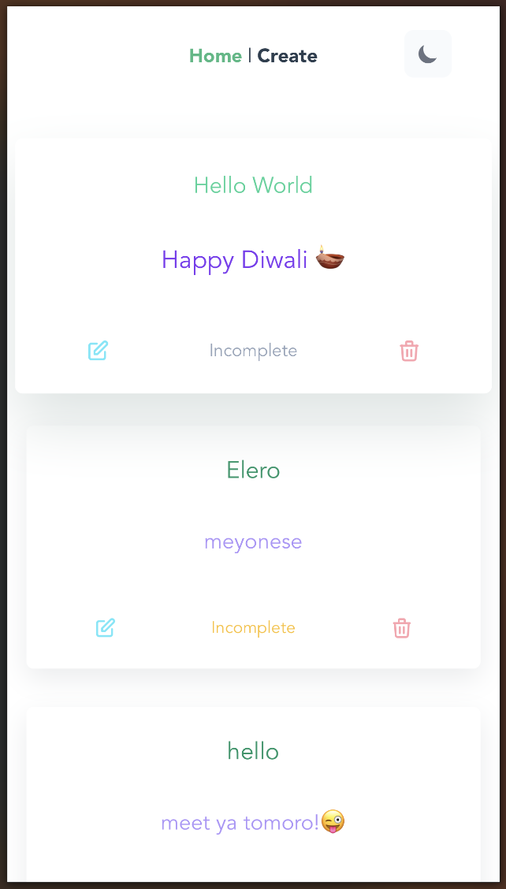

# Todo List - Vuejs Offline PWA

## Demo Pictures

##### Create Todo


##### View Todos



##### Edit Todo


## Table of Content

- [Todo List - Vuejs Offline PWA](#todo-list---vuejs-offline-pwa)
  - [Demo Pictures](#demo-pictures)
        - [Create Todo](#create-todo)
        - [View Todos](#view-todos)
        - [Edit Todos](#edit-todos)
  - [Table of Content](#table-of-content)
  - [Project Structure](#project-structure)
  - [Libraries and Frameworks](#libraries-and-frameworks)
  - [Project setup](#project-setup)
        - [Start development server](#start-development-server)
        - [Start production server](#start-production-server)

## Project Structure

```sh
.
├── README.md
├── package.json
├── postcss.config.js
├── src
│   ├── App.vue
│   ├── assets
│   │   ├── base.css
│   │   └── logo.png
│   ├── components
│   │   ├── index.ts
│   │   ├── toasts
│   │   │   ├── complete.vue
│   │   │   ├── delete.vue
│   │   │   ├── edit.vue
│   │   │   ├── incomplete.vue
│   │   │   └── index.ts
│   │   ├── uiAlert.vue
│   │   ├── uiButton.vue
│   │   ├── uiTextArea.vue
│   │   ├── uiTextInput.vue
│   │   ├── uiToast.vue
│   │   ├── uiTodoCard.vue
│   │   ├── uiToggle.vue
│   │   └── uiToggleTheme.vue
│   ├── db.ts
│   ├── main.ts
│   ├── registerServiceWorker.ts
│   ├── router
│   │   └── index.ts
│   ├── shims-vue.d.ts
│   ├── types
│   │   ├── Alert.ts
│   │   ├── State.ts
│   │   ├── Todo.ts
│   │   └── index.ts
│   ├── utils
│   │   ├── changeTheme.ts
│   │   ├── index.ts
│   │   └── validateTodo.ts
│   └── views
│       ├── CreateView.vue
│       └── HomeView.vue
├── tailwind.config.js
├── tsconfig.json
├── vue.config.js
└── yarn.lock

8 directories, 38 files
```

## Libraries and Frameworks

| Title       | Description                                                                                                                                                             |
| ----------- | ----------------------------------------------------------------------------------------------------------------------------------------------------------------------- |
| Vuejs       | An approachable, performant and versatile framework for building web user interfaces.                                                                                   |
| Tailwindcss | A utility-first CSS framework packed with classes like `flex`, `pt-4`, `text-center` and `rotate-90` that can be composed to build any design, directly in your markup. |
| Flowbite    | Flowbite is an ecosystem built on top of Tailwind CSS including a component library, block sections, a Figma design system and other resources.                         |
| Dexie       | A Minimalistic Wrapper for IndexedDB, a client-side database.                                                                                                           |
| HeroIcons   | Beautiful hand-crafted SVG icons, by the makers of Tailwind CSS.                                                                                                        |

## Project setup

```bash
npm install
or
yarn install
```

##### Start development server

```bash
npm run serve
or
yarn serve
```

##### Start production server

```bash
npm run build && npm run serve
or
yarn build && yarn serve
```

<br/>

> ```sh
> Local server will start on `http://localhost:8080`
> ```
